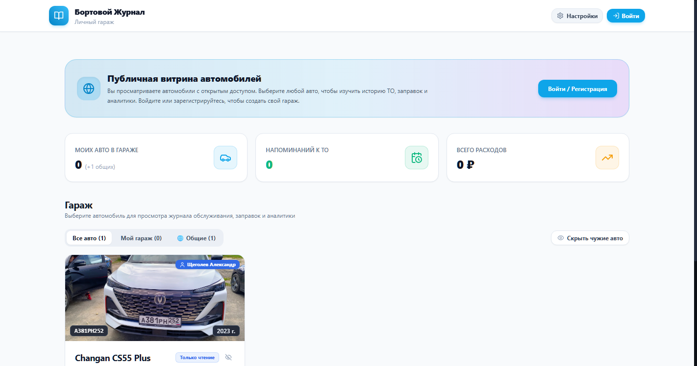
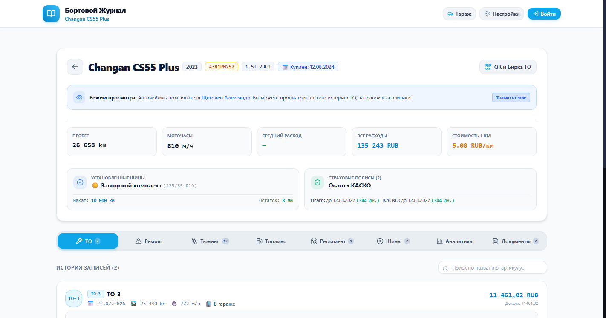
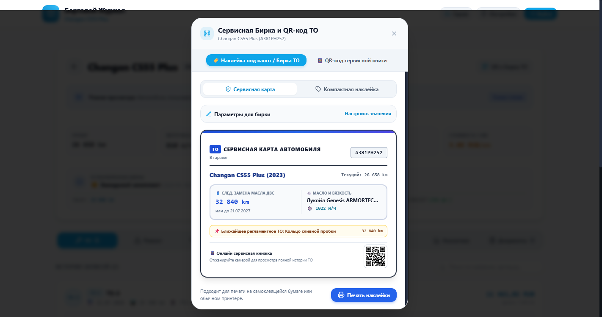
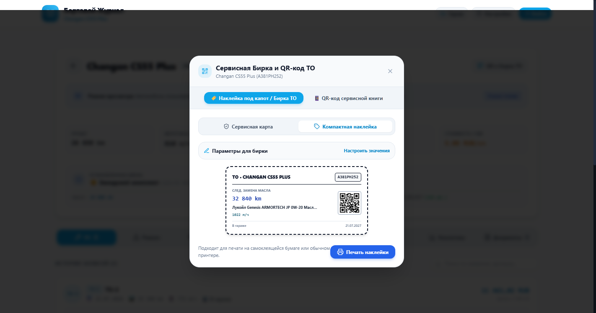
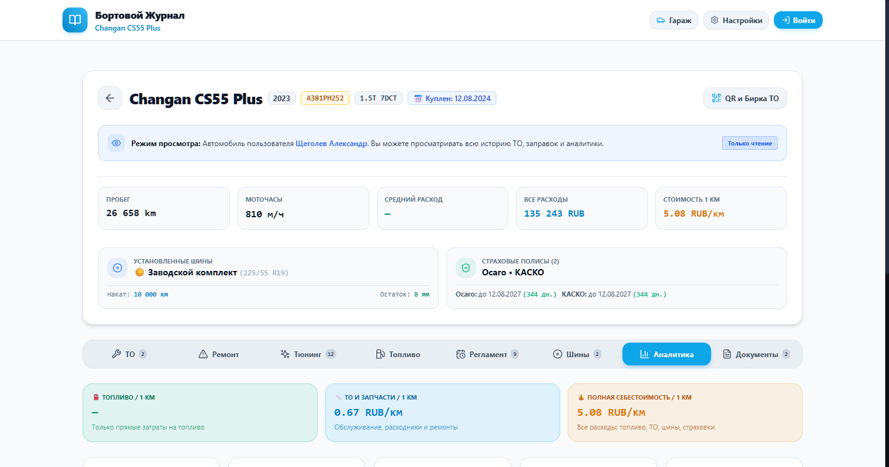

# 🚗 Бортовой Журнал Автомобиля (AutoTracker)

> **Современное, быстрое и многофункциональное веб- и мобильное PWA-приложение для комплексного учета технического обслуживания (ТО), ремонтов, тюнинга, заправок, колес и дисков, страховок, моточасов, подкапотных сервисных бирок, QR-кодов и детальной аналитики расходов на автомобиль.**

Автор и разработчик: **Александр Щеголев** ([@scanek](https://github.com/scanek))  
Официальный репозиторий: **[https://github.com/scanek/to_auto](https://github.com/scanek/to_auto)**  
Текущая версия: **v2.3.0 (Security & Production Hardening)**

---

---

## 📸 Скриншоты интерфейса

| Публичная витрина гаража | Журнал ТО и карточка автомобиля |
| :---: | :---: |
|  |  |

| Сервисная карта ТО с QR-кодом | Компактная подкапотная наклейка (90×50 мм) |
| :---: | :---: |
|  |  |

| Аналитика затрат и себестоимость 1 км | Комплекты шин, дисков и датчики TPMS |
| :---: | :---: |
|  |  |

---

## 🌟 Полный обзор возможностей программы

### 👥 1. Многопользовательский режим (Multi-User) и безопасность
* **Личные изолированные гаражи**: каждый пользователь регистрируется со своим логином/паролем (хеширование `bcrypt`) и имеет доступ **исключительно к своим автомобилям и данным**.
* **Аутентификация по стандартам JWT**: безопасные токены доступа с автоматическим обновлением сессии.
* **Панель управления пользователями (Администрирование)**:
  * Первый зарегистрированный пользователь автоматически получает статус **Администратора (Admin)**.
  * Администратор может просматривать список всех зарегистрированных пользователей и их автомобилей.
  * Возможность смены пароля любому пользователю напрямую из интерфейса.
  * Изменение роли (Назначить администратором / Снять права администратора).
  * Безопасное удаление пользователей с защитой от случайного удаления собственной учетной записи.
* **Автоматическая миграция БД**: при обновлении все существующие автомобили и записи бережно сохраняются.

---

### 🌐 2. Публичная гостевая витрина и управление доступом
* **Гостевой режим без регистрации**: незарегистрированные посетители могут зайти на сайт и ознакомиться с витриной открытых автомобилей.
* **Тумблер «🌐 Публичный автомобиль»**: владелец может одним кликом сделать автомобиль публичным (он появится на главной странице и во вкладке «🌐 Общие») или оставить личным (🔒 виден только владельцу).
* **Безопасный режим «Только чтение»**: гости и другие пользователи могут просматривать историю ТО, заправок, графики и накат шин, но не могут вносить изменения. Любая попытка добавления или редактирования открывает окно авторизации.

---

### 📱 3. QR-код сервисной книжки, Подкапотная бирка ТО и Календарь
* **📱 Векторный QR-код книги ТО**:
  * В карточке каждого авто генерируется персональный QR-код, ведущий на электронную сервисную книгу.
  * Отсканировав QR-код камерой любого смартфона, клиент, мастер или покупатель авто мгновенно открывает всю сервисную историю без регистрации.
  * Кнопки «Скопировать ссылку» и «Поделиться» через системное меню смартфона.
* **🏷️ Сервисная бирка / наклейка под капот**:
  * **Шаблон «🛡️ Сервисная карта»**: солидный дилерский стиль с данными о марке, госномере, следующей замене масла, вязкости, моточасах, ближайшем регламенте ТО и QR-кодом.
  * **Шаблон «🏷️ Компактная наклейка»**: мини-формат 90×50 мм для стандартных самоклеек и термопринтеров.
  * **Строгая фильтрация моторного масла**: алгоритм безошибочно отделяет моторное масло двигателя от масел КПП, АКПП, редукторов и ATF.
  * **Точный расчет**: строго складывает пробег последней замены моторного масла и регламентный интервал (например, $60\,000 + 7\,500 = 67\,500	ext{ км}$).
  * **Интерактивная настройка перед печатью**: возможность вручную скорректировать пробег, вязкость, моточасы, дату и название СТО/мастера перед выводом на печать.
  * **Идеальная печать ровно в 1 страницу (`@media print`)**: принтер выводит строго одну чистую наклейку без лишних элементов интерфейса.
* **📅 Напоминания в календарь смартфона в 1 клик (`.ics`)**:
  * Кнопка **«📅 В календарь»** в карточке QR-кода и в каждом пункте регламентов ТО.
  * Мгновенный экспорт в **Apple Calendar (iPhone/Mac)**, **Google Calendar (Android)**, **Яндекс Календарь** и **Outlook** с предустановленными напоминаниями (за 7 дней и за 1 день до обслуживания).

---

### 🏢 4. Гараж и профиль автомобиля
* **Неограниченное количество автомобилей**: ведение личного автопарка или семейных машин в одном месте.
* **Детальные параметры машины**:
  * Марка, модель, поколение, двигатель, мощность, год выпуска, госномер и VIN-код.
  * Фотография автомобиля.
  * **Момент покупки и ввода в эксплуатацию**: фиксация точной даты покупки автомобиля и начального пробега на одометре в день покупки.
  * Текущий пробег (одометр) и наработка двигателя в моточасах (м/ч).
  * **⚡ Быстрое обновление пробега и моточасов в 1 клик** из карточки автомобиля.
* **Спецификации ГСМ**: вязкость моторного масла, класс качества и допуски (API/ACEA), объем заливки картера.
* **Индивидуальная локализация**: выбор валюты (`₽`, `$`, `€`, `₸`, `Br` и др.) и единиц расстояния (`км` / `мили`).

---

### 🔧 5. Журнал технического обслуживания (ТО), Ремонтов и Тюнинга
* **Типизация записей**:
  * 🟢 **Плановое ТО**: регламентные работы (замена масла, фильтров, свечей и жидкостей) с тегами (`ТО-0`, `ТО-1`, `ТО-2`... `ТО-10`).
  * 🔴 **Ремонты**: внеплановые работы, диагностика и устранение неисправностей.
  * 🟣 **Тюнинг и допы**: учет доработок, установки аксессуаров, шумоизоляции, пленок и стайлинга.
* **🔍 Живой поиск и фильтрация**:
  * Мгновенный поиск по названиям работ, наименованиям запчастей, брендам, артикулам и магазинам.
* **Калькулятор запчастей и расходников**:
  * Динамический расчет стоимости по формуле: `Количество × Цена = Сумма`.
  * Выбор единиц измерения: **шт** (штуки), **л** (литры), **компл** (комплекты), **кан** (канистры), **уп** (упаковки), **кг** (килограммы), **г** (граммы), **м** (метры).
  * Раздельный учет стоимости выполненных работ (сервиса) и стоимости запчастей.
* **Интеграция с интернет-магазинами**:
  * Быстрый выбор площадки покупки (*Ozon, Wildberries, Exist, Автодок, Emex, Авито, Яндекс Маркет, Официальный дилер*).
  * Сохранение прямых кликабельных ссылок на карточки товаров или заказы.
  * Учет каталожных номеров (артикулов) и брендов запчастей.
* **Прикрепление документов и фото**:
  * Загрузка фотографий чеков, заказ-нарядов со станций техобслуживания и установленных деталей.

---

### ⏰ 6. Умный планировщик регламентов и пакет ТО в 1 клик
* **Гибридные триггеры регламентов**:
  * Напоминание по **пробегу** (например, каждые 7 500 км).
  * Напоминание по **моточасам** (например, каждые 250 м/ч).
  * Напоминание по **времени** (например, каждые 12 месяцев).
  * *Срабатывание происходит по тому условию, которое наступит раньше.*
* **Пакет регламентов по умолчанию в 1 клик**:
  * Кнопка автоматического добавления базового регламента ТО (Масло ДВС + масляный фильтр, воздушный, салонный, свечи зажигания, тормозная жидкость, масло АКПП/трансмиссии, антифриз).
* **Интеллектуальная точка отсчета (Baseline)**:
  * Возможность установить начальный отсчет регламента **с момента покупки автомобиля** или **с последнего ТО**.
* **Наглядные индикаторы состояния**:
  * Цветовые прогресс-бары износа: **В норме 🟢** -> **Скоро ТО 🟡** -> **Просрочено 🔴**.
  * Кнопка **«Выполнено» в 1 клик** со сдвигом срока на следующий интервал.
* **Push-уведомления**: мгновенные браузерные и системные оповещения на смартфоне и ПК о приближении срока обслуживания.

---

### 🛞 7. Комплекты шин, колесных дисков и датчики TPMS
* **Учет сезонных комплектов**:
  * Летние (☀️), Зимние (❄️) и Всесезонные шины.
  * Фиксация размера резины (например, `225/55 R19`), бренда и модели.
  * **Дата покупки шин** и **DOT-код / год производства** (например, `4223` или `2023 г.`).
  * Контроль остатка глубины протектора в мм и наката в км.
  * Место сезонного хранения (*Гараж, Балкон, Шинный отель*).
* **Учет колесных дисков (Wheel Rims)**:
  * Переключатель *«На отдельных дисках»*.
  * Модель и тип дисков (*Литые, Кованые, Оригинальные заводские*).
  * Параметры дисков (*сверловка, вылет ET, ширина, DIA*).
  * **Дата покупки дисков** и их стоимость.
  * Наличие и частота **датчиков давления TPMS** (*«Оригинальные 433 МГц»*).
* **Сезонная переобувка в 1 клик**:
  * Мгновенный перенос статуса «На автомобиле» между летним и зимним комплектом.
  * Автоматический раздельный подсчет пробега на каждом комплекте колес.

---

### ⛽ 8. Журнал заправок и расход топлива
* **Точный расчет расхода топлива**: учет заправок по методу «до полного бака» с контролем пропущенных заправок.
* **Автоматическая статистика**:
  * Средний расход на 100 км пути (л/100 км).
  * Стоимость 1 км пути по топливу.
  * График динамики расхода и цен на топливо.
* **Параметры заправки**: тип и марка топлива (АИ-95, АИ-100, ДТ), сеть АЗС, объем в литрах, цена за литр и итоговый чек.

---

### 📑 9. Документы, страховки и сроки действия
* **Учет полисов и документов**:
  * ОСАГО, КАСКО, Диагностическая карта (Техосмотр), Водительское удостоверение, Договор купли-продажи.
* **Контроль сроков**:
  * Номер документа, страховая компания, стоимость и дата окончания действия.
  * Автоматический обратный отсчет оставшихся дней с цветовой индикацией и уведомлением о необходимости продления.

---

### 📊 10. Аналитика всех расходов и себестоимость владения (TCO)
* **Структура всех затрат**: интерактивная круговая диаграмма (ТО и Ремонты, Топливо, Тюнинг, Шины и Колеса, Страховки).
* **Динамика расходов по месяцам**: наглядная столбчатая гистограмма всех затрат по периодам.
* **Реальная стоимость 1 км пути**: сквозной расчет всех эксплуатационных расходов на 1 километр пробега автомобиля (общая стоимость 1 км, стоимость топлива на 1 км, стоимость обслуживания на 1 км).
* **Сводные финансовые счетчики**: общая сумма владения автомобилем за все время.

---

### 📄 11. Электронная сервисная книжка (PDF) и экспорт в Excel
* **Электронная сервисная книжка (PDF / Print-Ready HTML)**:
  * Профессионально оформленный отчет с защищенной структурой.
  * Шапка с полными характеристиками авто: марка, модель, VIN-номер, госномер, дата покупки с пробегом ввода, текущий пробег и моточасы, спецификация масла.
  * Детальный блок всех комплектов шин и дисков с датами покупки и параметрами.
  * Хронологическая таблица всех выполненных ТО и ремонтов с артикулами деталей, ценами и суммами.
  * Кнопка быстрой печати и сохранения в PDF для сервиса или продажи авто новому владельцу.
* **Структурированная выгрузка в Excel (.xlsx)**:
  * **Лист 1: Сводка автомобиля** (полная карточка, VIN, дата покупки, пробег при покупке, общие затраты, средний расход).
  * **Лист 2: Журнал ТО и Ремонтов** (каждая работа, артикулы, магазины, ссылки, стоимость).
  * **Лист 3: Журнал Заправок** (все заправки, пробеги, расход топлива, АЗС).
  * **Лист 4: Шины и Колеса** (все комплекты резины, дисков, датчики TPMS, даты покупок, цены).
  * **Лист 5: Документы и Страховки** (полисы, компании, сроки, стоимость).

---

### 💾 12. Резервное копирование и перенос данных (JSON Backup)
* **Экспорт бэкапа отдельного авто**: сохранение полной истории конкретной машины в единый файл в 1 клик.
* **Экспорт полного архива всей базы данных**: резервная копия всех пользователей, машин, фото и чеков.
* **Интеллектуальный импорт и восстановление**: безопасная загрузка с валидацией структуры данных.

---

### 📱 13. Мобильное приложение (PWA), Offline-режим и дизайн
* **Установка как мобильное приложение**:
  * Поддержка установки на главный экран Android (Chrome / Яндекс) и iOS (Safari).
  * Кастомная иконка приложения высокого разрешения (`512x512`, `192x192`, `apple-touch-icon`).
  * Полноэкранный режим (Standalone) без рамок браузера.
* **Offline-First**:
  * Локальное кэширование интерфейса через Service Worker.
  * Добавление записей без подключения к интернету с автоматической синхронизацией при появлении сети.
* **Современный адаптивный UI**:
  * Светлая и темная темы оформления.
  * Адаптивная верстка, оптимизированная под экраны смартфонов, планшетов и десктопов.

---

## 🚀 Быстрый запуск в Docker

### 1. Клонирование репозитория
```bash
git clone https://github.com/scanek/to_auto.git
cd to_auto
```

### 2. Запуск контейнера
```bash
docker compose up -d --build
```

### 3. Доступ к приложению
* **Веб-приложение:** [http://localhost:9900](http://localhost:9900) *(или IP-адрес вашего сервера / NAS, например `http://192.168.1.100:9900`)*
* **Интерактивная документация REST API (Swagger UI):** [http://localhost:9900/docs](http://localhost:9900/docs)

*Все данные пользователей, базы данных SQLite и прикрепленные файлы чеков надежно сохраняются в Docker volume `autotracker_data`.*

---

## 🔄 Обновление приложения на сервере

Для обновления работающего контейнера на сервере до последней версии выполните одну команду:

```bash
git fetch origin && git reset --hard origin/main && docker compose build --no-cache && docker compose up -d
```

---

## 🛠️ Стек технологий

* **Frontend:** React 18, TypeScript, Tailwind CSS, Lucide Icons, Recharts, Vite, PWA (Service Worker, Web App Manifest, IndexedDB).
* **Backend:** Python 3.11+, FastAPI, SQLAlchemy (Async), SQLite + aiosqlite, Pydantic v2, PyJWT, Passlib (Bcrypt), OpenPyXL, Jinja2.
* **Развертывание:** Docker, Docker Compose, Uvicorn, Nginx/Static Server.

---

## 📄 Лицензия и условия использования

Авторские права принадлежат: **Александр Щеголев** ([@scanek](https://github.com/scanek)).

* 🟢 **Личное и некоммерческое использование**: полностью **бесплатно и свободно** для частных лиц, персонального учета личных и семейных автомобилей.
* 💼 **Коммерческое использование**: любое использование проекта в коммерческих целях (на станциях техобслуживания, в автосервисах, детейлинг-центрах, коммерческих автопарках, таксопарках, платных сервисах, White-Label брендирование или перепродажа) **требует обязательного согласования с разработчиком и заключения коммерческого лицензионного договора с выплатой вознаграждения по договоренности**.

Полный текст лицензии доступен в файле [LICENSE](LICENSE).
